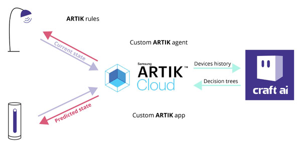

# **craft ai** / Samsung ARTIK Cloud starter kit #

[](https://travis-ci.org/craft-ai/craft-ai-starterkit-artik-cloud) [](LICENSE)

Integration of [**craft ai**](http://craft.ai) in [**ARTIK Cloud**](https://my.artik.cloud/).
Application written in Node.js using [**craft ai** official js client](https://www.npmjs.com/package/craft-ai).
This demo makes use of a [Philips Hue color lamp with its control bridge](http://www2.meethue.com/en-us/productdetail/philips-hue-white-and-color-ambiance-starter-kit-a19-gen-2) and a [Netatmo Welcome camera](https://www.netatmo.com/product/security/welcome).

## Architecture ##

### Overall integration ###
The integration of **craft ai** in **ARTIK Cloud** makes heavy use of the **ARTIK Cloud** rule engine. The idea is to have a custom-made virtual **ARTIK Cloud** device that will be the intermediate between the other devices and **craft ai**. Using **ARTIK Cloud** rules, this virtual device will be notified whenever the state of a physical device (here, the light bulb and the camera) has changed. Through a [websocket](https://developer.artik.cloud/documentation/api-reference/websockets-api.html), the application will listen to any action sent to this virtual device, redirecting them to a [**craft ai** agent](https://beta.craft.ai/doc#3---create-an-agent) as [context operations](https://beta.craft.ai/doc#4---add-context-operations). This agent will then update its decision tree according to the new context operations received, decision tree that will be used by the application to predict what should be the state of the light. The virtual device on **ARTIK Cloud** will be updated with the predicted state of the light, which will in turn trigger an action on the light (still using **ARTIK Cloud** rules), applying the predicted settings.



### Application architecture ###

The application can be broken down into 3 modules:
- the `server` module which will handle the authentication with **ARTIK Cloud** and retrieve an application token; this module is the entry point of the application
- the `artik` module deals with the virtual **ARTIK Cloud** device through a websocket: it will receive actions triggered on the device by **ARTIK Cloud** rules and send messages to update its state
- the `learning` module makes the link with **craft ai** by instantiating a client with the required configuration and providing helpers to create an agent, feeding it context operations and retrieving a decision.


> Note: To keep the demo simple, the only feature of the light that is taken into account in the automation is the color. There is a finite set of colors used, which are discretized on a red component scale, as defined in the [src/data/colors.json](src/data/colors.json) file.

> Following the same pattern as what has been done to manage the color of the light bulb, it would be possible to automate its on/off state as well as its brightness by creating two dedicated agents.

## Setup ##

### ARTIK Cloud Developers ###

#### ARTIK Cloud Device type ####

> TODO add more details on that.

First you will need to create a custom `craft ai - Light Color Manager` [device type](https://developer.artik.cloud/dashboard/devicetypes), which will be used by your virtual intermediate **ARTIK Cloud** device. To do so, simply click on the `+ New device type` button, give it a name, then create a new manifest defining the following fields and actions:

Activate the manifest: your device type as been created.

For the purpose of this demo, it is more convenient to change the plan of this device type from "Hobbyist" to "Business", allowing a higher daily quota per device.

> You do not need worry about pricing: since only one instance of this device type will be created, you will not be charged anything by ARTIK Cloud; you do not even need to input any payment info.

#### ARTIK Cloud Application ####
- From the [applications](https://developer.artik.cloud/dashboard/applications) page, add a new application
- set the `Authorization methods` to "Client credentials, auth code" (default value)
- set the `Auth redirect URL` to http://localhost:4200/callback and save
- add "read" and "write" `Device permissions` to the `craft ai - Light Color Manager` device type you previously defined

### My ARTIK Cloud ###

#### Devices ####
- From the [devices](https://my.artik.cloud/devices) page, add a new device of type `Philips Hue`
- Authorize the use of your Philips Hue device by **ARTIK Cloud**
- This will automatically create new devices associated to your Philips Hue bulbs
- Add a new device of type`Netatmo Welcome` and authorize **ARTIK Cloud** to use it
- Add a new device of type `craft ai - Light Color Manager`, and generate a token for this device

#### Rules ####


The **ARTIK Cloud** rules used in this demo have been created using the [ARTIK Cloud `Rules` page](https://my.artik.cloud/rules).
It is also possible to create application-dependant rules by using the [ARTIK Cloud Rules REST API](https://developer.artik.cloud/documentation/api-reference/rest-api.html#rules). You can create the required rules through this API by posting the content of the [src/data/rules.json](src/data/rules.json) file (replacing `LightId`, `cameraId` and `craftDeviceId` fields by the actual device ids) using a valid application token.

> Note that creating those rules using the API won't allow you to inspect and test them in the **ARTIK Cloud** `Rules` page.

> Be careful as creating a given rule multiple times will trigger the associated actions that many times whenever the required conditions are met.

Basically the rules are the following:
- Notifying whenever the light color has changed
```js
if (light.colorRGB.r != craftDevice.CurrentLightRedComponent) {
  craftDevice.lightColorChanged(redComponent = light.colorRGB.r)
}
```
- Notifying whenever a person has been detected by the camera
```js
if (camera.person.id != '') {
  craftDevice.personDetected(id = camera.person.id)
}
```
- Applying the result of the decision to the light
```js
if (craftDevice.PredictedLightRedComponent == 0) { // green
  light.setColorRGB(red = 0, green = 250, blue = 50)
}
```
```js
if (craftDevice.PredictedLightRedComponent == 50) { // blue
  light.setColorRGB(red = 50, green = 0, blue = 250)
}
```
```js
if (craftDevice.PredictedLightRedComponent == 100) { // white
  light.setColorRGB(red = 100, green = 100, blue = 50)
}
```
```js
if (craftDevice.PredictedLightRedComponent == 150) { // purple
  light.setColorRGB(red = 150, green = 100, blue = 200)
}
```
```js
if (craftDevice.PredictedLightRedComponent == 200) { // orange
  light.setColorRGB(red = 200, green = 200, blue = 0)
}
```
```js
if (craftDevice.PredictedLightRedComponent == 250) { // red
  light.setColorRGB(red = 250, green = 50, blue = 50)
}
```


### Node.JS application ###
- Download or clone the [sources from GitHub](https://github.com/craft-ai/artik-cloud-webinar/),
- Install [Node.JS](https://nodejs.org/en/download/) on your computer,
- Install dependencies by running `npm install` in a terminal from the directory where the sources are.
- in this directory, create a `.env` file setting the following variables:
    - `CRAFT_TOKEN` allows you to [authenticate your calls to the **craft ai** API](https://beta.craft.ai/doc#header-authentication),
    - `CRAFT_OWNER` defines the **owner** of the **craft ai** agent that will be created (should be your **craft ai** user name)
    - `ARTIK_APP_CLIENT_ID` is the **ARTIK Cloud** client id of your [**ARTIK Cloud** applications](https://developer.artik.cloud/dashboard/applications)
    - `ARTIK_APP_CLIENT_SECRET` is the **ARTIK Cloud** client secret of your **ARTIK Cloud** applications
    - `ARTIK_CRAFT_DEVICE_ID` refers to the [**ARTIK Cloud** device](https://my.artik.cloud/devices) id of the 'craft ai - Light Color Manager' device
    - `ARTIK_CRAFT_DEVICE_TOKEN` refers to the **ARTIK Cloud** device token of the 'craft room manager' device

## Usage ##

### Run ###

```console
> npm run start
```
In the web page that opens upon running the application, log into you Samsung account and accept the required permissions.

### Play ###
At the beginning, the light is set to a red color. You can play around by showing or not in front of the camera and changing the light color using the `test` button of the manually created rules in the [**ARTIK Cloud** `Rules` page](https://my.artik.cloud/rules)


Within a handful of minutes your **craft ai** agent will have learned patterns correlating the color of the light to the number of persons seen by the camera, allowing to automate the change of the color.


You can inspect your own decision tree by going to the [**craft ai** inspector](https://beta.craft.ai/inspector/LightColor).

## Help ##

- [craft ai documentation](https://beta.craft.ai/doc)
- [Mail at support@craft.ai]('mailto:support@craft.ai')
